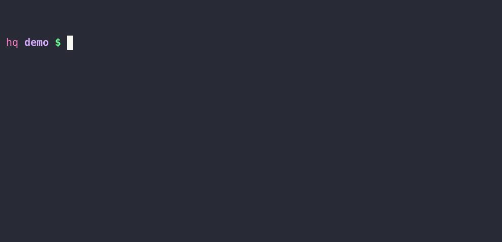

# Docspec

[](https://badge.fury.io/rb/docspec)
[](https://github.com/DannyBen/docspec/actions?query=workflow%3ATest)
[](https://codeclimate.com/github/DannyBen/docspec/maintainability)

Docspec lets you reuse your Markdown documents as the unit tests for your
Ruby library.

---


## Installation

```
$ gem install docspec
```


## Demo




## Usage

Docspec expects one or more Markdown files with embedded code snippets to 
test.

Code snippets should be enclosed in a `ruby` or `shell` code fence:

```ruby
puts "code to test (should output something)"
#=> code to test (should output something)
```

This document itself serves as the test suite for this gem, so you can take a
look at its source.


### Testing with the `docspec` command line

- Running `docspec` without arguments will run on `./README.md`
- Running `docspec` with a filename, will run on that filename
- Running `docspec` with a directory, will run on all the markdown files in
  that directory.

If your bundle includes the `simplecov` gem, it will be automatically loaded
and generate coverage report in the `coverage` directory.


### Testing from Ruby code

```ruby
# Running from Ruby code
document = Docspec::Document.from_file 'test/sample.md'
document.test
#=> pass : Sample Test

puts document.success?
#=> true
```


```ruby
# Test a file using the CLI class
runner = Docspec::CLI.new 'test/sample.md'
success = runner.run
#=> file : test/sample.md
#=> pass : Sample Test
#=> 
#=> 1 tests, 0 failed
```


```ruby
# Test multiple folders/files using the CLI class
runner = Docspec::CLI.new 'test', 'test/sample.md'
success = runner.run
#=> file : test/folder/another.md
#=> pass : Another Sample Test
#=> 
#=> file : test/sample.md
#=> pass : Sample Test
#=> 
#=> file : test/sample2.md
#=> pass : echo shell
#=> void : echo shell
#=> pass : puts "ruby"
#=> void : puts "ruby"
#=> 
#=> file : test/sample.md
#=> pass : Sample Test
#=>
#=> 7 tests, 0 failed

```


## Examples

Code examples that you want to test, should output something to stdout. 
Specify the expected output by prefixing it with `#=>`:

```ruby
# The first line is an optional label
puts 'hello world'.upcase
#=> HELLO WORLD
```

If an example raises an exception, the captured output will be the `#inspect`
string of that exception:

```ruby
# Exceptions are captured
puts "hello".camel_case
#=> #<NoMethodError: undefined method `camel_case' for an instance of String>
```

Your code and expected output can contain multiple lines of code:

```ruby
# Multiple lines of code
string = "hello"
3.times do 
  puts string
end
#=> hello
#=> hello
#=> hello
```

and you can alternate between code and expected output:

```ruby
# Interleaving code and output 
puts 2 + 3
#=> 5

puts 2 - 3
#=> -1
```

or have the expected output in the same line as its code:

```ruby
puts 2 * 3    #=> 6
puts 'works'  #=> works
```

The first line of the example may contain specially formatted flags. Flags 
are always formatted like this: `[:flag_name]`. 

The `[:ignore_failure]` flag allows the example to fail. It will show the 
failure in the output, but will not elevate the exit status to a failure 
state:

```ruby
# This example may fail [:ignore_failure]
# Due to the :ignore_failure flag, it will show the failure diff, but will
# not be considered a failure in the exit status.
puts 'hello world'.upcase
#=> hello world
```

Another available flag, is the `[:skip]` flag, which will omit the example
from the test run:

```ruby
# [:skip]
this will not be executed
```

Sometimes it is useful to build the example over several different code 
blocks. To help achieve this, docspec will treat any example that does not 
expect any output (no `#=> markers`) as a code that needs to be executed
before all subsequent examples:

```ruby
# Define functions or variables for later use
def create_caption(text)
  [text.upcase, ("=" * text.length)].join "\n"
end

message = 'tada!'
```

All the examples below this line, will have the above function available:

```ruby
# Use a previously defined function or variable
puts create_caption message
#=> TADA!
#=> =====
```


Examples marked with a `shell` code fence will be executed by the
shell, and not by ruby:

```shell
# Shell commands
echo hello world
#=> hello world
```

and they also support chaining of examples:

```shell
# Prepend shell example to all subsequent shell examples
# (since this example does not define an expected output)
SOME_ENV_VAR=yes
```

```shell
echo $SOME_ENV_VAR
#=> yes
```
